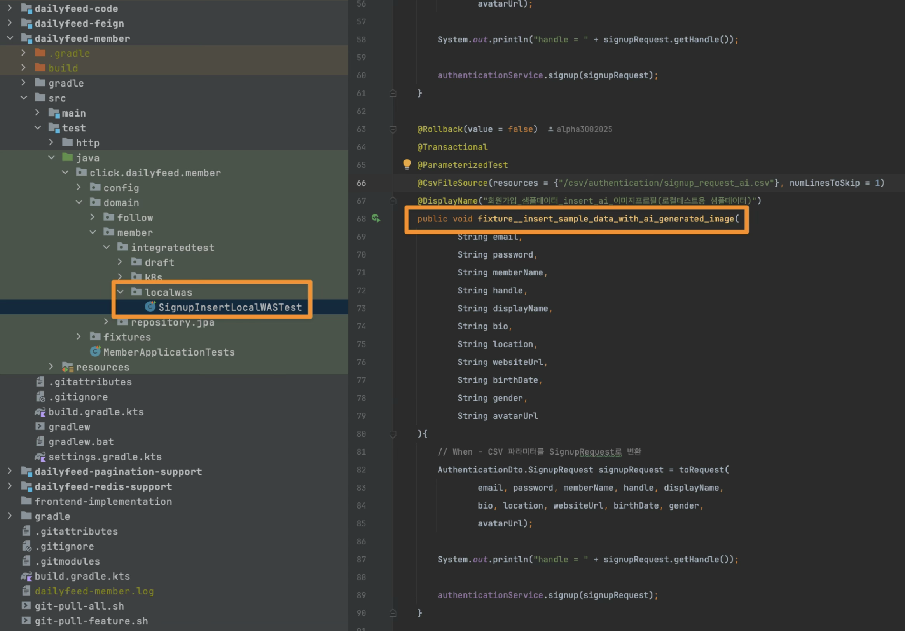
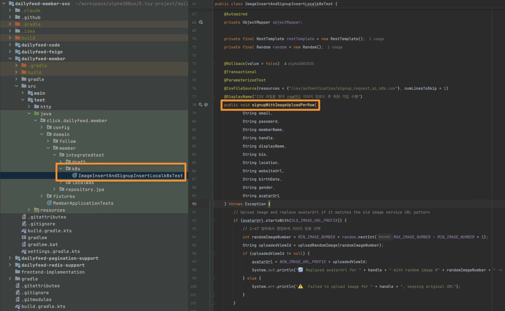

# 실행

실행은 `local-was`, `local`,  `dev` 프로필로 실행할수 있습니다.

- local-was 실행 (docker-compose 기반으로 infra 설치 후 각각의 서비스를 로컬 PC 에서 jar 파일로 실행)
- local 실행 (Local PC 내의 kind 기반 k8s 내에서 `local` 프로필로 실행)
- dev 실행 
  - dev 프로필로 실행
  - MySQL, MongoDB 는 외부 인프라 + redis, kafka 만 Local PC 내의 kind 기반 k8s 내에 설치
  - 애플리케이션들은 모두 Local PC 내의 kind 기반 k8s 내에 설치

<br/>


## local-was 

- 로컬 실행은 `local-was` 프로필로 실행합니다.

```bash
cd dailyfeed-content-svc
source run-local-was.sh
```

<br/>


## local

local PC 에서 k8s 기반 실행 

- local PC 에서 k8s 기반 실행은 `local` 프로필로 실행합니다.  

- infra 설치와 함께 모두 설치할 경우 다음명령어를 수행합니다.

```bash
cd dailyfeed-installer
source local-install-infra-and-app.sh {이미지버전} # e.g. cbt-20251103-1
```


local PC 에서 infra 설치 → application 별도 설치 (member,content,timeline,search,activity,image) 를 하려 할 경우 다음 명령어로 수행합니다.

```bash
## infra 설치
cd dailyfeed-installer
cd dailyfeed-infrastructure
source install-all-infra.sh

## application 설치
cd dailyfeed-installer
cd dailyfeed-app-helm
source install-local.sh cbt-20251103-1 ## cbt-20251103-1 은 이미지 태그 입니다. 어떤 태그를 쓸지 모르겠다면 main 태그를 활용해주세요.
```


개별 앱을 helm uninstall 후 다시 install 해서 검증하려 할 경우 다음과 같이 해주세요.

```bash
## 수정하려는 helm app 이 dailyfeed-content 일 경우
cd dailyfeed-app-helm
cd member
source uninstall-helm.sh ## dailyfeed-content 제거
source install-helm-local.sh ## dailyfeed-content 실행 
```

<br/>


## dev

local PC 에서 dev 프로필로 실행할 경우 (dev 프로필로 EKS 로 배포시에는  cluster 만 EKS 로 변경해서 수행하면 됨)

- local PC 에서 dev 기반 실행은 `dev` 프로필로 실행합니다.
- 비용 문제로 인해 infra 중 redis, kafka 만 클러스터에서 파드로 띄워서 사용합니다.
- mysql, mongodb 의 경우 외부 서비스를 활용하는 방식이며, 이 방식이 리소스 소모가 적어서 데이터베이스 인프라를 외부 인프라를 사용할 경우에 대한 방식입니다.

```bash
cd dailyfeed-installer
source dev-install-infra-and-app.sh {이미지버전} # e.g. cbt-20251103-1
```


local PC 에서 infra 설치 → application 별도 설치 (member,content,timeline,search,activity,image) 를 하려 할 경우 다음 명령어로 수행합니다.

이때 mysql, mongodb 는 설치되지 않습니다.

```bash
## infra 설치
cd dailyfeed-installer
cd dailyfeed-infrastructure
source install-dev-infra.sh

## application 설치
cd dailyfeed-installer
cd dailyfeed-app-helm
source install-dev.sh cbt-20251103-1 ## cbt-20251103-1 은 이미지 태그 입니다. 어떤 태그를 쓸지 모르겠다면 main 태그를 활용해주세요.
```

<br/>


# 이미지 빌드

애플리케이션을 수정 후 이미지를 빌드 해서 실행해야 할 경우 다음 절차를 따라주세요.

**Github Actions 에서 실행할 경우**<br/>

1. 수동 실행: Actions 탭에서 "Docker Build and Push" 선택 → Run workflow → 이미지 버전 입력
2. 자동 실행: main 또는 develop 브랜치에 push하면 자동으로 빌드


만약 의존성을 지우고 새로 시작할 경우 다음의 명령어를 -svc 디렉터리 레벨에서 실행합니다.

```bash
./gradlew clean build --refresh-dependencies
```

<br/>


**Jib 빌드를 local 에서 실행할 경우**

```bash
# 방법 1: 환경변수 사용
IMAGE_VERSION=cbt-20251103-1 ./jibDockerBuild.sh

# 방법 2: 인자 사용
./jibDockerBuild.sh cbt-20251103-1
```

<br/>


# git clone

새로운 환경에서 clone 할 경우 다음의 명령을 수행해주시기 바랍니다.

```bash
# 새로운 환경에서 클론 (clone)
git clone --recurse-submodules http://github.com/alpha3002025/dailyfeed-content-svc  

# 또는 클론 후 submodule 초기화
git clone dailyfeed-content-svc
cd dailyfeed-content-svc
git submodule init
git submodule update
```


# git submodule 업데이트

모든 submodule 을 최신 상태로 업데이트

```bash
## 모든 submodule 을 최신 상태로 업데이트
git submodule update —remote

## 특정 submodule 만 업데이트 
git submodule update —remote dailyfeed-code

## 또는 다음과 같이 main 브랜치를 pull 하는 코드를 실행해주세요.
source git-pull-all.sh
```

<br/>


# 새로운 원격 submodule repository 를 현재 repository 에 submodule 로 추가

```bash
## 모든 submodule 을 clone 및 gitmodules 등록
git submodule add https://github.com/alpha3002025/dailfyeed-redis-support dailyfeed-redis-support

## settings.gradle.kts 에는 다음 구문을 추가합니다.
include(“dailyfeed-redis-support”)
```

<br/>


# 테스트 회원 데이터 insert

50 명 정도의 회원데이터를 직접 사람이 기입해서 회원가입 버튼을 누르면서  follow/unfollow 하는 것을 테스트하기는 쉽지 않습니다. 이런 이유로 Test 코드로 테스트 데이터를 insert 하는 코드를 만들어두었습니다.<br/>

> dailyfeed-member-svc (https://github.com/alpha3002025/dailyfeed-member-svc) 프로젝트 내에서 실행해주시면 됩니다.


## (1) local-was 프로필 

- local-was 프로필은 로컬에서 docker-compose 로 인프라 설치한 환경 내에서 테스트 환경내에서 jar 를 띄워서 테스트를 하는 방식입니다.



(1) `src/test/java/click.dailyfeed.member/domain/member/integratedtest/localwas/SignupInsertLocalWASTest.java` 를 선택합니다.

(2) 테스트 클래스 내에 다음 테스트 메서드를 실행합니다.
- `fixture__insert_sample_data_with_ai_generated_image()` 

(3) 이렇게 하면 docker-compose 로 설치한 infra (mysql) 에 회원 데이터들이 insert 됩니다.

<br/>


## (2) local 프로필

- local 프로필은 로컬에서 k8s로 인프라 설치한 환경 내에서 helm 기반으로 member,content,timeline,search,image,activity 디플로이를 띠워서 실행하는 방식입니다.



<br/>


# Troubleshoot
## org/springframework/security/core/userdetails/UserDetailsService.class] cannot be opened because it does not exist
application 을 local profile 로 Local WAS 로 구동시에 다음과 같은 에러가 날 수 있습니다.
```plain
org/springframework/security/core/userdetails/UserDetailsService.class] cannot be opened because it does not exist
```
<br/>

전체 로그는 다음과 같을 수 있습니다.
```plain
org.springframework.beans.factory.BeanDefinitionStoreException: I/O failure while processing configuration class [click.dailyfeed.member.config.security.userdetails.CustomUserDetailsServiceImpl]
	at org.springframework.context.annotation.ConfigurationClassParser.processConfigurationClass(ConfigurationClassParser.java:286) ~[spring-context-6.2.10.jar:6.2.10]
	at org.springframework.context.annotation.ConfigurationClassParser.parse(ConfigurationClassParser.java:218) ~[spring-context-6.2.10.jar:6.2.10]
	at org.springframework.context.annotation.ConfigurationClassParser.doProcessConfigurationClass(ConfigurationClassParser.java:354) ~[spring-context-6.2.10.jar:6.2.10]
	at org.springframework.context.annotation.ConfigurationClassParser.processConfigurationClass(ConfigurationClassParser.java:281) ~[spring-context-6.2.10.jar:6.2.10]
	at org.springframework.context.annotation.ConfigurationClassParser.parse(ConfigurationClassParser.java:204) ~[spring-context-6.2.10.jar:6.2.10]
	at org.springframework.context.annotation.ConfigurationClassParser.parse(ConfigurationClassParser.java:172) ~[spring-context-6.2.10.jar:6.2.10]
	at org.springframework.context.annotation.ConfigurationClassPostProcessor.processConfigBeanDefinitions(ConfigurationClassPostProcessor.java:418) ~[spring-context-6.2.10.jar:6.2.10]
	at org.springframework.context.annotation.ConfigurationClassPostProcessor.postProcessBeanDefinitionRegistry(ConfigurationClassPostProcessor.java:290) ~[spring-context-6.2.10.jar:6.2.10]
	at org.springframework.context.support.PostProcessorRegistrationDelegate.invokeBeanDefinitionRegistryPostProcessors(PostProcessorRegistrationDelegate.java:349) ~[spring-context-6.2.10.jar:6.2.10]
	at org.springframework.context.support.PostProcessorRegistrationDelegate.invokeBeanFactoryPostProcessors(PostProcessorRegistrationDelegate.java:118) ~[spring-context-6.2.10.jar:6.2.10]
	at org.springframework.context.support.AbstractApplicationContext.invokeBeanFactoryPostProcessors(AbstractApplicationContext.java:791) ~[spring-context-6.2.10.jar:6.2.10]
	at org.springframework.context.support.AbstractApplicationContext.refresh(AbstractApplicationContext.java:609) ~[spring-context-6.2.10.jar:6.2.10]
	at org.springframework.boot.web.servlet.context.ServletWebServerApplicationContext.refresh(ServletWebServerApplicationContext.java:146) ~[spring-boot-3.5.5.jar:3.5.5]
	at org.springframework.boot.SpringApplication.refresh(SpringApplication.java:752) ~[spring-boot-3.5.5.jar:3.5.5]
	at org.springframework.boot.SpringApplication.refreshContext(SpringApplication.java:439) ~[spring-boot-3.5.5.jar:3.5.5]
	at org.springframework.boot.SpringApplication.run(SpringApplication.java:318) ~[spring-boot-3.5.5.jar:3.5.5]
	at org.springframework.boot.SpringApplication.run(SpringApplication.java:1361) ~[spring-boot-3.5.5.jar:3.5.5]
	at org.springframework.boot.SpringApplication.run(SpringApplication.java:1350) ~[spring-boot-3.5.5.jar:3.5.5]
	at click.dailyfeed.member.MemberApplication.main(MemberApplication.java:10) ~[main/:na]
Caused by: java.io.FileNotFoundException: class path resource [org/springframework/security/core/userdetails/UserDetailsService.class] cannot be opened because it does not exist
	at org.springframework.core.io.ClassPathResource.getInputStream(ClassPathResource.java:215) ~[spring-core-6.2.10.jar:6.2.10]
	at org.springframework.core.type.classreading.SimpleMetadataReader.getClassReader(SimpleMetadataReader.java:54) ~[spring-core-6.2.10.jar:6.2.10]
	at org.springframework.core.type.classreading.SimpleMetadataReader.<init>(SimpleMetadataReader.java:48) ~[spring-core-6.2.10.jar:6.2.10]
	at org.springframework.core.type.classreading.SimpleMetadataReaderFactory.getMetadataReader(SimpleMetadataReaderFactory.java:103) ~[spring-core-6.2.10.jar:6.2.10]
	at org.springframework.boot.type.classreading.ConcurrentReferenceCachingMetadataReaderFactory.createMetadataReader(ConcurrentReferenceCachingMetadataReaderFactory.java:98) ~[spring-boot-3.5.5.jar:3.5.5]
	at org.springframework.boot.type.classreading.ConcurrentReferenceCachingMetadataReaderFactory.getMetadataReader(ConcurrentReferenceCachingMetadataReaderFactory.java:85) ~[spring-boot-3.5.5.jar:3.5.5]
	at org.springframework.core.type.classreading.SimpleMetadataReaderFactory.getMetadataReader(SimpleMetadataReaderFactory.java:81) ~[spring-core-6.2.10.jar:6.2.10]
	at org.springframework.boot.type.classreading.ConcurrentReferenceCachingMetadataReaderFactory.getMetadataReader(ConcurrentReferenceCachingMetadataReaderFactory.java:75) ~[spring-boot-3.5.5.jar:3.5.5]
	at org.springframework.context.annotation.ConfigurationClassParser.asSourceClass(ConfigurationClassParser.java:711) ~[spring-context-6.2.10.jar:6.2.10]
	at org.springframework.context.annotation.ConfigurationClassParser$SourceClass.getInterfaces(ConfigurationClassParser.java:1060) ~[spring-context-6.2.10.jar:6.2.10]
	at org.springframework.context.annotation.ConfigurationClassParser.processInterfaces(ConfigurationClassParser.java:441) ~[spring-context-6.2.10.jar:6.2.10]
	at org.springframework.context.annotation.ConfigurationClassParser.processInterfaces(ConfigurationClassParser.java:449) ~[spring-context-6.2.10.jar:6.2.10]
	at org.springframework.context.annotation.ConfigurationClassParser.doProcessConfigurationClass(ConfigurationClassParser.java:385) ~[spring-context-6.2.10.jar:6.2.10]
	at org.springframework.context.annotation.ConfigurationClassParser.processConfigurationClass(ConfigurationClassParser.java:281) ~[spring-context-6.2.10.jar:6.2.10]
	... 18 common frames omitted
```
<br/>


### Solution
이 경우 다음과 같이 의존성을 새로고침 해주시기 바랍니다.
```bash
./gradlew clean build --refresh-dependencies
```

